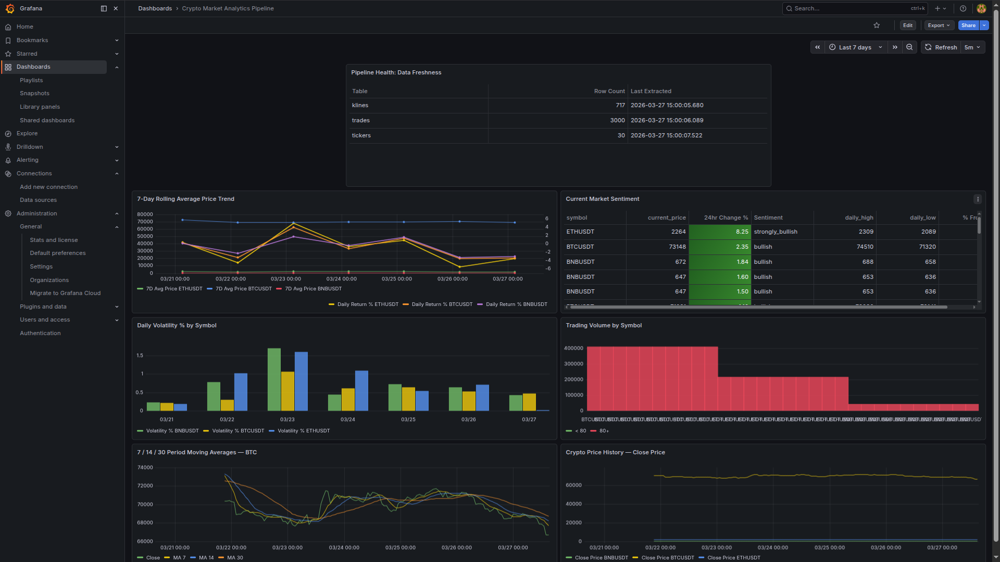
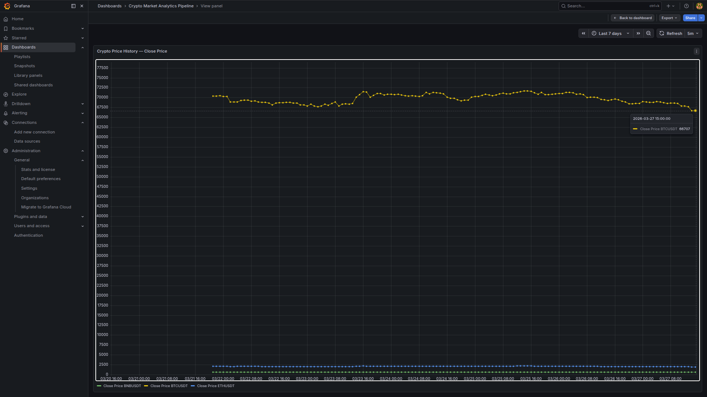
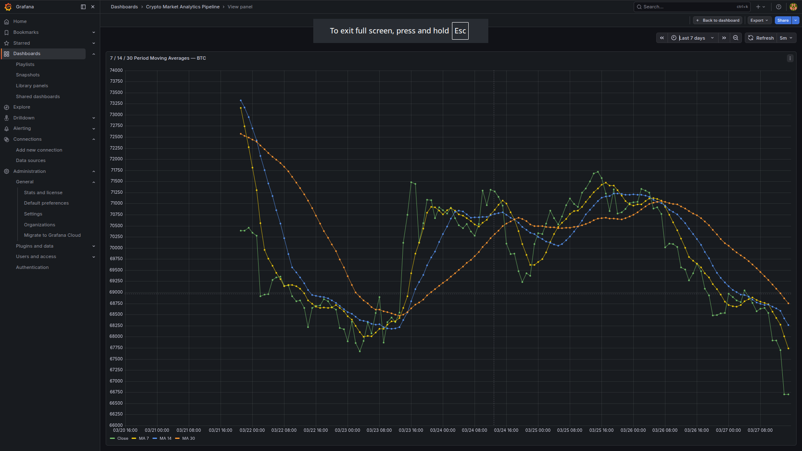
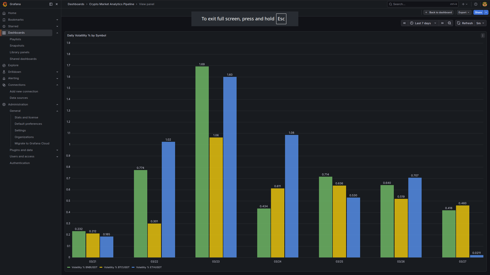
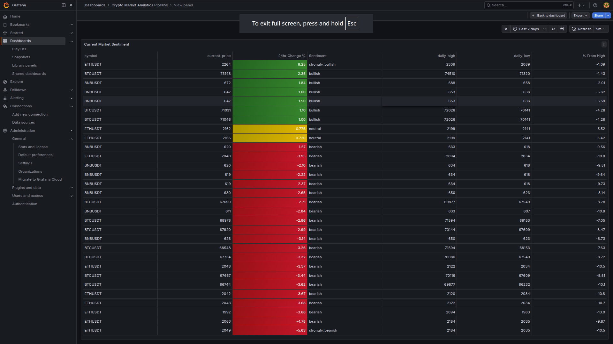
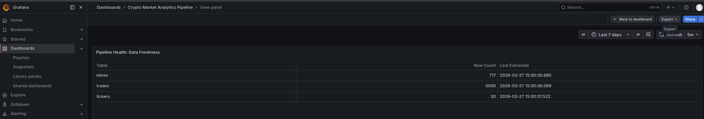

# Crypto Market Analytics Pipeline

A production-style ELT data pipeline that extracts live cryptocurrency
market data from the Binance API, loads it into PostgreSQL, transforms
it using dbt, and visualizes insights in a Grafana dashboard.

---

## Architecture
```
Binance Public API
       ↓
Python Extraction (requests)
       ↓
Raw PostgreSQL Tables
       ↓
dbt Staging Models   → clean, cast, deduplicate
       ↓
dbt Intermediate     → moving averages, volatility, volume metrics
       ↓
dbt Mart Tables      → facts, dimensions, daily summaries
       ↓
Grafana Dashboard    → live crypto market intelligence
```

---

## Tech Stack

| Tool | Purpose |
|---|---|
| Python 3 | API extraction and data loading |
| PostgreSQL | Data warehouse |
| dbt Core | Data transformation and modeling |
| Grafana | Dashboard and visualization |
| Git & GitHub | Version control |

---

## Data Sources

All data comes from the **Binance Public REST API** and no API key required.

| Endpoint | Data |
|---|---|
| `/api/v3/klines` | OHLCV candlestick data (1hr intervals) |
| `/api/v3/trades` | Individual trade transactions |
| `/api/v3/ticker/24hr` | 24-hour market statistics |

**Trading pairs tracked:** BTCUSDT · ETHUSDT · BNBUSDT

---

## Pipeline Layers

### Raw Layer (PostgreSQL)

| Table | Description |
|---|---|
| `raw_binance_klines` | OHLCV candlestick records |
| `raw_binance_trades` | Individual trade transactions |
| `raw_binance_tickers` | 24hr market statistics |

### Staging Layer (dbt views)

| Model | Description |
|---|---|
| `stg_binance_klines` | Clean candlestick data with candle direction |
| `stg_binance_trades` | Clean trades with buy/sell direction |
| `stg_binance_tickers` | Clean 24hr market stats |

### Intermediate Layer (dbt views)

| Model | Description |
|---|---|
| `int_price_metrics` | MA 7/14/30, volatility, returns, volume ratio |
| `int_symbol_volume` | Volume aggregation, dominance %, rankings |

### Mart Layer (dbt tables)

| Model | Description |
|---|---|
| `fct_crypto_candles` | Core price fact table with all signals |
| `fct_crypto_trades` | Trade facts with whale classification |
| `dim_symbols` | Trading pair dimension with market sentiment |
| `mart_daily_market_summary` | Pre-aggregated daily market view |

---

## Key Analytics

- What is the daily average price of each cryptocurrency?
- Which cryptocurrency has the highest trading volume?
- What is the hourly price volatility for each coin?
- Which trading pair has the largest price movement?
- What is the 7-day rolling average price trend?
- Are there unusual volume spikes signaling market activity?
- What is the current buy vs sell pressure per coin?

---

## Project Structure
```
crypto-pipeline/
├── extract/
│   └── binance_extract.py
├── load/
│   └── load_to_postgres.py
├── dbt_project/
│   ├── models/
│   │   ├── staging/
│   │   ├── intermediate/
│   │   └── marts/
│   └── dbt_project.yml
├── grafana/
│   └── crypto_dashboard.json
├── assets/
│   └── screenshots/
├── .env.example
├── .gitignore
└── README.md
```

---

## Setup & Installation

### Prerequisites
- Ubuntu Linux
- Python 3.8+
- PostgreSQL 14+
- dbt Core (`pip install dbt-postgres`)
- Grafana (local install)

### 1. Clone the repository
```bash
git clone https://github.com/theedataengineer/crypto-pipeline.git
cd crypto-pipeline
```

### 2. Create virtual environment
```bash
python3 -m venv venv
source venv/bin/activate
pip install -r requirements.txt
```

### 3. Configure environment variables
```bash
cp .env.example .env
# Edit .env with your PostgreSQL credentials
```

### 4. Set up PostgreSQL
```bash
sudo -u postgres psql
```
```sql
CREATE USER binance_pipeline WITH PASSWORD 'your_password';
CREATE DATABASE binance_db OWNER binance_pipeline;
GRANT ALL PRIVILEGES ON DATABASE binance_db TO binance_pipeline;
```

### 5. Run the pipeline
```bash
python extract/binance_extract.py
python load/load_to_postgres.py
cd dbt_project && dbt run && dbt test
```

### 6. Configure dbt profile

Create `~/.dbt/profiles.yml`:
```yaml
dbt_project:
  target: dev
  outputs:
    dev:
      type: postgres
      host: localhost
      port: 5432
      user: binance_pipeline
      password: your_password
      dbname: binance_db
      schema: public
      threads: 4
```

### 7. Import Grafana dashboard

1. Open `http://localhost:3000`
2. Go to **Dashboards → Import**
3. Upload `grafana/crypto_dashboard.json`
4. Select **Crypto Pipeline** as the data source

---

## Automated Pipeline (Cron)
```bash
0  * * * * cd ~/crypto-pipeline && source venv/bin/activate && python extract/binance_extract.py
5  * * * * cd ~/crypto-pipeline && source venv/bin/activate && python load/load_to_postgres.py
10 * * * * cd ~/crypto-pipeline/dbt_project && source ~/crypto-pipeline/venv/bin/activate && dbt run
```

---

## dbt Documentation
```bash
cd dbt_project
dbt docs generate
dbt docs serve
```

Opens at `http://localhost:8080`. Includes full data lineage graph.

---

## Dashboard Preview

The Grafana dashboard connects directly to PostgreSQL and auto-refreshes
every 5 minutes, giving a live view of the crypto market pipeline.

---

### Full Dashboard Overview



The complete dashboard showing all 6 panels across the last 7 days: pipeline health, 7-day rolling average price trend, daily volatility,
trading volume by symbol, moving averages, and close price history
for BTCUSDT, ETHUSDT, and BNBUSDT.

---

### Crypto Price History : Close Price



7-day close price history for all three trading pairs. BTCUSDT (yellow)
dominates the chart trading in the 66,000–70,000 USDT range over the
period, with the tooltip showing BTC at 66,707 USDT on 2026-03-27.

---

### 7 / 14 / 30 Period Moving Averages : BTC



Bitcoin close price overlaid with MA7 (green), MA14 (yellow), and MA30
(orange) over 7 days. Price peaked around 73,500 USDT on 03/22 and
declined toward 66,500 USDT by 03/27. The convergence of MA7 below
MA14 signals a developing death cross, a bearish momentum indicator.

---

### Daily Volatility % by Symbol



Daily volatility percentage grouped by symbol across 7 days. The most
volatile day was 03/23. BNBUSDT peaked at 1.69% and ETHUSDT at 1.60%.
Volatility compressed to near zero by 03/27, indicating market
consolidation.

---

### Current Market Sentiment



Color-coded sentiment table derived from 24hr price change data.
ETHUSDT leads at +8.25% (strongly bullish) and BTCUSDT at +2.35%
(bullish), grading through yellow (neutral) down to red (strongly
bearish at -5.63%).

---

### Pipeline Health : Data Freshness



Raw table row counts and last extraction timestamps. As of 2026-03-27
15:00 UTC: klines: 717 rows, trades: 3,000 rows, tickers: 30 rows.

---

## What I Learned

- Designing and implementing a production ELT pipeline from scratch
- Extracting data from a live REST API and handling failures gracefully
- PostgreSQL schema design for analytical workloads
- dbt data modeling across staging, intermediate, and mart layers
- Writing idempotent loads using `ON CONFLICT DO NOTHING`
- SQL window functions for moving averages and volatility calculations
- Connecting Grafana to PostgreSQL for live dashboard visualization
- Scheduling automated pipelines with cron

---

## Author

**Dennis Kirimi**
Risk Data Engineer
[LinkedIn](https://www.linkedin.com/in/denniskirimi1999/) ·
[Portfolio](https://denniskirimi.netlify.app/) ·
[GitHub](https://github.com/theedataengineer)

---

## License

MIT License: feel free to fork and build on this project.